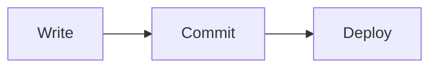

# Diagrams

A fenced block tagged `mermaid` renders as a diagram:

````markdown

````


This is the same syntax GitHub, Docusaurus and most other documentation tools
use, so a project moving here keeps its diagrams exactly as they are — nothing
to rewrite.

Every [Mermaid](https://mermaid.js.org) diagram type works: flowcharts,
sequence, state, class, ER, Gantt, pie, timeline and the rest. See
[the examples page](../examples/diagrams.md) for more.

## What it costs

The library is around half a megabyte, so it is **loaded only by pages that
contain a diagram** — a page without one never downloads it, and it is not in
the initial bundle.

Diagrams render in the browser rather than at build time. The consequence worth
knowing: a diagram does not appear in the prerendered HTML a crawler reads. The
diagram's *source* does, as text inside the element, so the content is still
indexable — but if a diagram carries information a search engine must see,
repeat it in prose.

## When a diagram is wrong

Mermaid is strict about syntax. Rather than failing silently or breaking the
page, a diagram that will not parse shows what you wrote and what Mermaid
objected to:

```mermaid
graph TD
  A --> B
  this line is not valid mermaid
```

Fix the source and it renders on the next build.

## Theme

Diagrams follow the site theme, and re-render when a reader switches it —
Mermaid writes colours into the SVG, so they cannot simply be restyled.

## Diagrams versus components

Mermaid is the right tool for a diagram that describes a process: a flow, a
sequence, a state machine. For anything interactive, or a chart tied to real
data, a [doc component](./index.md) gives you a real Angular component with
state, and styling that matches the rest of the site.
