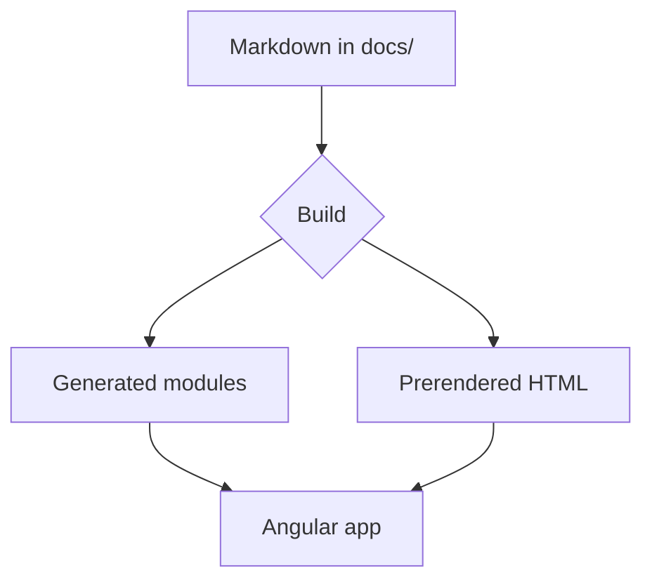
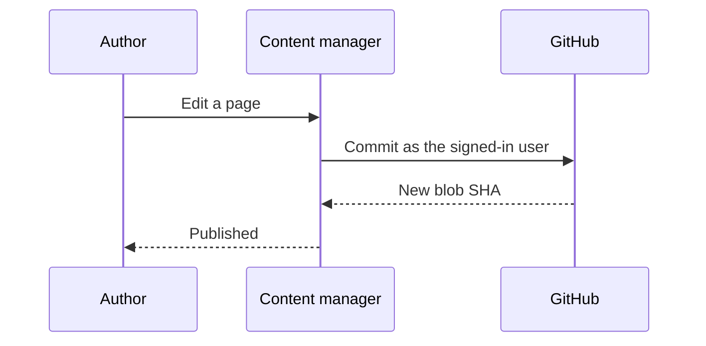
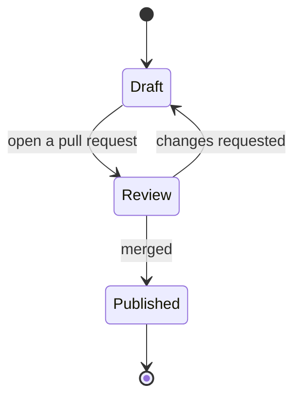

# Diagrams

Fenced ```` ```mermaid ```` blocks render as diagrams — the same syntax GitHub,
Docusaurus and most other tools use, so an existing project keeps its diagrams
as they are.

## Flowchart



## Sequence



## State



:::note
The library is loaded only by pages that contain a diagram, and the source stays
in the page until it renders — so a diagram with a syntax error shows what you
wrote and what Mermaid objected to, instead of disappearing.
:::
