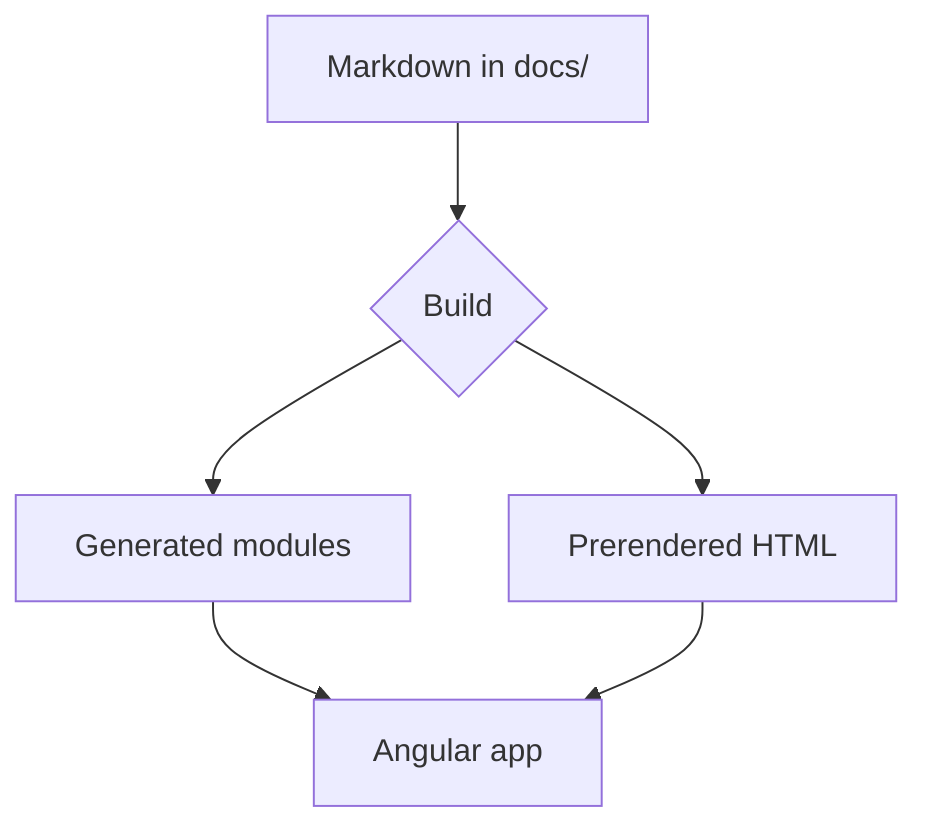
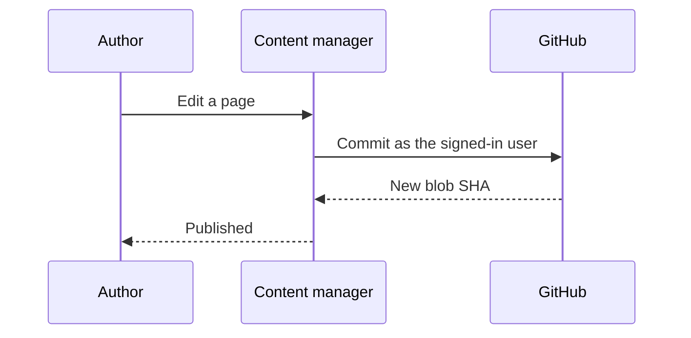
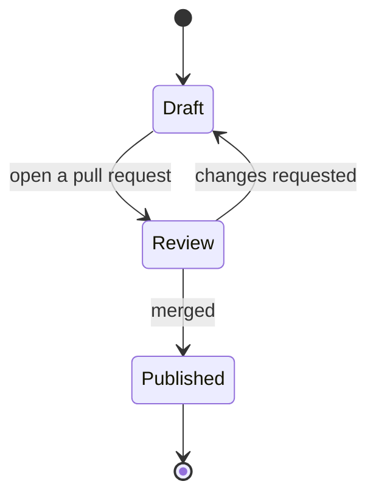
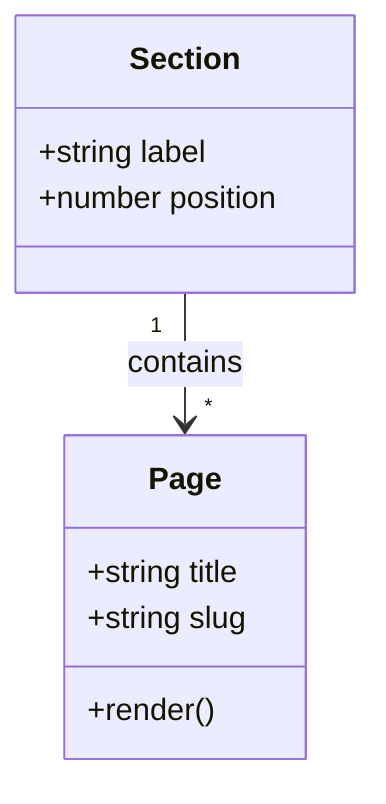
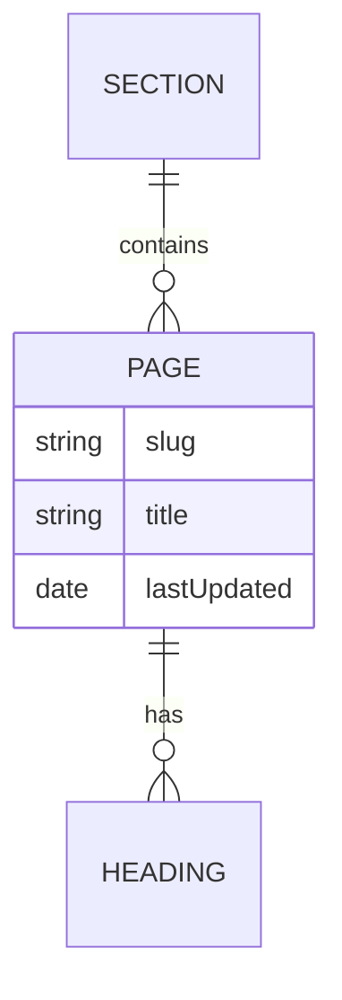
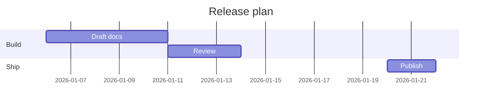
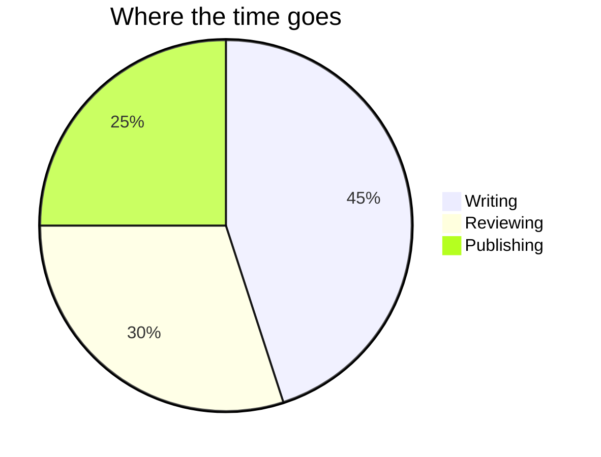

# Diagrams

Fenced ```` ```mermaid ```` blocks render as diagrams — the same syntax GitHub,
Docusaurus and most other tools use, so an existing project keeps its diagrams
as they are.

## Flowchart

````markdown

````

Renders as:


## Sequence

````markdown

````

Renders as:


## State

````markdown

````

Renders as:


## Class

````markdown

````

Renders as:


## Entity relationship

````markdown

````

Renders as:


## Gantt

````markdown

````

Renders as:


## Pie

````markdown

````

Renders as:


## When a diagram will not parse

Mermaid is strict. Rather than breaking the page or vanishing, a diagram it
cannot read shows your source and its complaint:

````markdown
```mermaid
flowchart TD
  A --> B
  this line is not valid mermaid
```
````

Renders as:

```mermaid
flowchart TD
  A --> B
  this line is not valid mermaid
```

:::note
The library is loaded only by pages that contain a diagram, and the source stays
in the page until it renders — so a diagram with a syntax error shows what you
wrote and what Mermaid objected to, instead of disappearing.
:::
